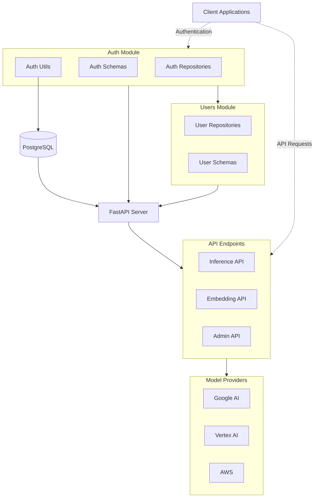

# AI API Framework
This is a FastApi application that will be able to wrap different inference backends to simplify interacting with them.

The standard interface for chat is the OpenAI Chat Completion API. 



## Running Dev:

Keep uv up-to-date:
```
uv self update
```

## First time here?

### Database
You will need to have Postgres running locally (although you could probably make Sqlite work without too much trouble).

The simplest way is to just pull a docker container. We're using pgvector since we may end up storying embdeddings at some point:

```
   docker run --name pgvector_postgres -e POSTGRES_PASSWORD=postgres -e POSTGRES_DB=postgres -p 5433:5432 pgvector/pgvector:pg15
```
Add the connection string to a .env to pull it into the settings (see .env_example).

### Running code

This project uses `uv`. You should be able to install it by following the [installation documentation](https://docs.astral.sh/uv/getting-started/installation/). The `curl` shell command is the recommended and fastest way to install uv.

Once installed you can sync the dependencies. This will automatically create a `.venv` folder, but you can generally ignore it while using uv. 
```
uv sync
```

Start the server:

```
uv run fastapi dev
```

Running tests:

```
uv run pytest
```


## Database Migrations
This project uses alembic to manage changes to the database scheme.

Create a migration:
```
uv run alembic revision --autogenerate -m "First Migration"
```

Update tables:
```
uv run alembic upgrade head
```

## Create an API Key
You will need an API key to interact with the endpoints. There is a script `create_admin_user.py` with some code to create a user and generate and API key. API keys are not stored in the database, so look for the output on the terminal with the key and save it. Like previous commands you can run this with `uv` (or python with an active venv):

```
uv run create_admin_user.py -email admin@example.com --name "Testy Test"
```
